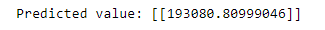

# Implementation-of-Linear-Regression-Using-Gradient-Descent

## AIM:
To write a program to predict the profit of a city using the linear regression model with gradient descent.

## Equipments Required:
1. Hardware – PCs
2. Anaconda – Python 3.7 Installation / Jupyter notebook

## Algorithm
1. Import the required library and read the dataframe.

2. Write a function computeCost to generate the cost function.

3. Perform iterations og gradient steps with learning rate.

4. Plot the Cost function using Gradient Descent and generate the required graph.

## Program:
```py
import numpy as np
import pandas as pd
from sklearn.preprocessing import StandardScaler, OneHotEncoder
from sklearn.compose import ColumnTransformer

def linear_regression(X, y, learning_rate=0.01, num_iters=1000):
    # Add a column of ones to X for the intercept term
    X = np.c_[np.ones(len(X)), X]
    # Initialize theta with zeros
    theta = np.zeros(X.shape[1]).reshape(-1, 1)

    # Perform gradient descent
    for _ in range(num_iters):
        # Calculate predictions
        predictions = X.dot(theta).reshape(-1, 1)
        # Calculate errors
        errors = predictions - y
        # Update theta using gradient descent
        theta -= learning_rate * (1 / len(X)) * X.T.dot(errors)

    return theta

# Load data
data = pd.read_csv('50_Startups.csv')

# Features and target variable
X = data.iloc[:, :-1].values  # All columns except the last one
y = data.iloc[:, -1].values.reshape(-1, 1)  # The last column

# One-hot encode the 'State' column
ct = ColumnTransformer([('encoder', OneHotEncoder(), [3])], remainder='passthrough')
X = ct.fit_transform(X)

# Scale features and target
scaler_X = StandardScaler()
scaler_y = StandardScaler()
X_scaled = scaler_X.fit_transform(X)
y_scaled = scaler_y.fit_transform(y)

# Learn model parameters
theta = linear_regression(X_scaled, y_scaled)

# Predict target value for a new data point
new_data = np.array([165349.2, 136897.8, 471784.1, 'New York']).reshape(1, -1)
new_data = ct.transform(new_data)
new_scaled = scaler_X.transform(new_data)
prediction = np.dot(np.append(1, new_scaled), theta)
prediction = prediction.reshape(-1, 1)
predicted_value = scaler_y.inverse_transform(prediction)

print(f"Predicted value: {predicted_value}")

```

## Output:



## Result:
Thus the program to implement the linear regression using gradient descent is written and verified using python programming.
